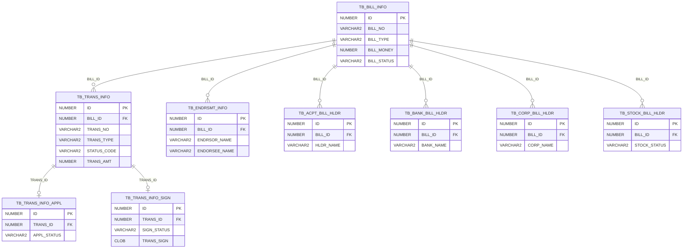
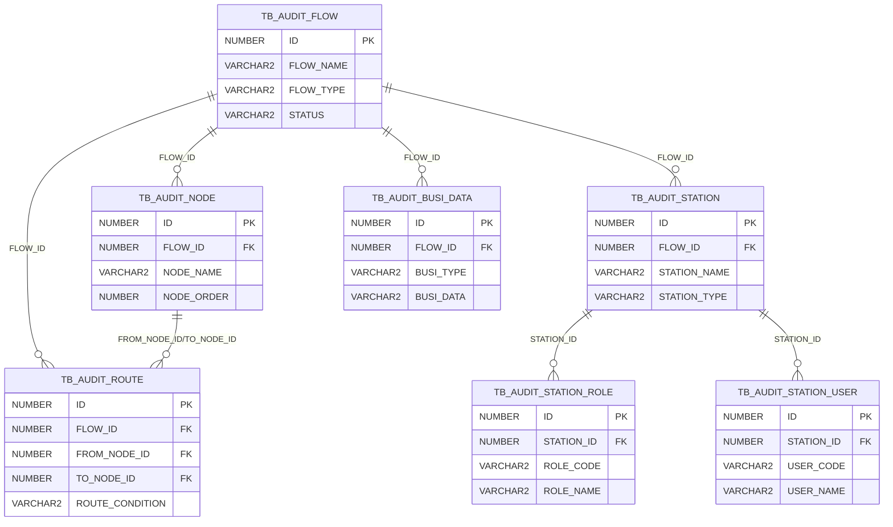
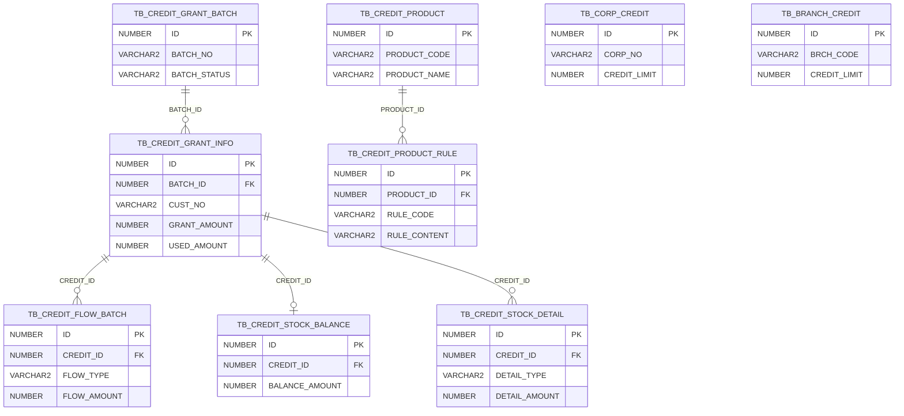
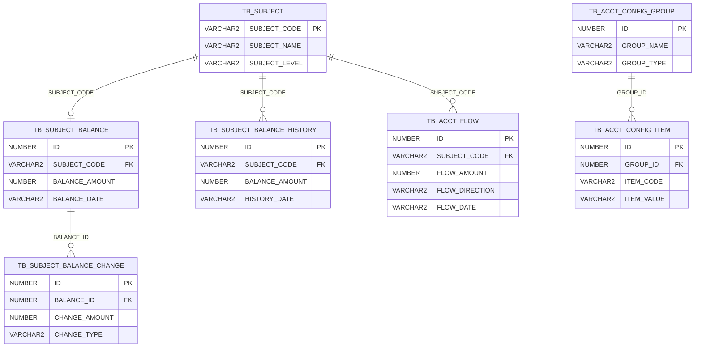
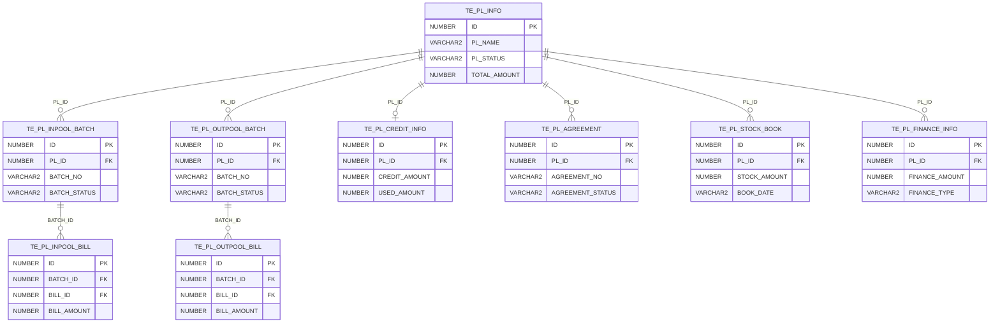
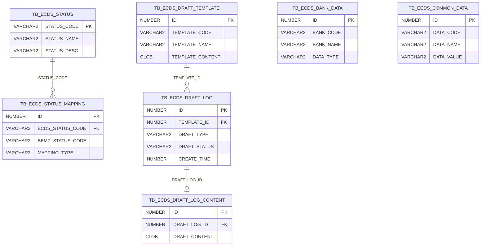

# BEMP\_HNNX 数据库全量表清单与ER关系图

> 数据库类型: Oracle 12c
> Schema: BEMP\_HNNX
> 表总数: 644
> 生成日期: 2026-05-18

***

## 一、数据库表总览

### 1.1 表分类统计

| 前缀分类     | 表数量  | 说明              |
| -------- | ---- | --------------- |
| TB\_     | 137  | 基础配置与业务主数据表     |
| TE\_     | 300+ | 业务交易与流程表        |
| HNNX\_   | 6    | 河南农商个性化表        |
| JSBANK\_ | 2    | 江苏银行个性化表        |
| BIN$     | 13   | Oracle回收站表（已删除） |

### 1.2 业务模块划分

| 模块编号 | 模块名称    | 表前缀/关键字                                   | 表数量(估) | 说明       |
| ---- | ------- | ----------------------------------------- | ------ | -------- |
| M01  | 票据信息管理  | TB\_BILL\_INFO, TB\_BILL\_INFO\_ASS       | 4      | 票据基础信息   |
| M02  | 票据交易管理  | TB\_TRANS\_INFO, TE\_\*                   | 80+    | 票据交易流转   |
| M03  | 承兑业务    | TE\_CE\_\*                                | 40+    | 承兑登记与管理  |
| M04  | 贴现业务    | TE\_DISC\_*, TE\_CE\_DISC\_*              | 30+    | 贴现申请与处理  |
| M05  | 转贴现业务   | TE\_REDISC\_*, TE\_SALE\_*, TE\_REBUY\_\* | 40+    | 转贴现买卖    |
| M06  | 质押/保证业务 | TE\_PB\_*, TE\_GUARNTR\_*                 | 15+    | 质押与保证    |
| M07  | 池化业务    | TE\_PL\_\*                                | 25+    | 票据池管理    |
| M08  | 标准化票据   | TE\_STD\_\*                               | 20+    | 标准化票据业务  |
| M09  | 供应链票据   | TE\_CPP\_\*                               | 25+    | 供应链票据平台  |
| M10  | 授信管理    | TB\_CREDIT\_*, TB\_CORP\_CREDIT\_*        | 20+    | 额度与授信    |
| M11  | 审批流程    | TB\_AUDIT\_*, TB\_FLOW\_*                 | 20+    | 审批流与节点   |
| M12  | 科目与账务   | TB\_SUBJECT\_*, TB\_ACCT\_*               | 25+    | 会计科目与账务  |
| M13  | ECDS对接  | TB\_ECDS\_\*                              | 15+    | 电子商业汇票系统 |
| M14  | 影像管理    | TB\_IMG\_*, TE\_CE\_*_IMG_\*              | 10+    | 票据影像     |
| M15  | 余额与对账   | TB\_BALANCE\_*, TB\_COMPARE\_*            | 10+    | 余额登记与对账  |
| M16  | 准备金管理   | TB\_PROVISION\_\*                         | 3      | 准备金计提    |
| M17  | 风险资产    | TB\_RISK\_ASSETS\_\*                      | 2      | 风险资产统计   |
| M18  | 支付管理    | TE\_PAY\_*, TE\_BO\_PAY\_*                | 6      | 支付确认     |
| M19  | 报价管理    | TE\_QUOTE\_*, TE\_PL\_WHITE\_QUOTE\_*     | 6      | 报价与容忍度   |
| M20  | 线下业务    | TE\_OFF\_\*                               | 10+    | 线下票据管理   |
| M21  | 个性化业务   | HNNX\_*, JSBANK\_*                        | 8      | 银行个性化表   |

***

## 二、各模块表清单与结构

### 2.1 M01 - 票据信息管理模块

核心表：票据基础信息登记与维护

| 表名                                                        | 主键                           | 数据量 | 说明      |
| --------------------------------------------------------- | ---------------------------- | --- | ------- |
| [TB\_BILL\_INFO](file:///d:/code/QJ/BEMP5.0DEV)           | PK\_TB\_BILL\_INFO           | 20  | 票据主表    |
| [TB\_BILL\_INFO\_ASS](file:///d:/code/QJ/BEMP5.0DEV)      | PK\_TB\_BILL\_INFO\_ASS      | 16  | 票据辅助信息表 |
| [TB\_BILL\_INFO\_CONTINUE](file:///d:/code/QJ/BEMP5.0DEV) | PK\_TB\_BILL\_INFO\_CONTINUE | 0   | 票据续作信息表 |
| [TB\_BILL\_LABEL](file:///d:/code/QJ/BEMP5.0DEV)          | PK\_TB\_BILL\_LABEL          | 0   | 票据标签表   |

#### TB\_BILL\_INFO 核心字段

| 字段名            | 类型            | 可空 | 说明       |
| -------------- | ------------- | -- | -------- |
| ID             | NUMBER        | N  | 主键       |
| BILL\_NO       | VARCHAR2(30)  | Y  | 票据号码     |
| BILL\_TYPE     | VARCHAR2(4)   | Y  | 票据类型     |
| BILL\_CLASS    | VARCHAR2(4)   | Y  | 票据类别     |
| BILL\_MONEY    | NUMBER        | Y  | 票面金额     |
| REMIT\_DT      | NUMBER        | Y  | 出票日期     |
| ACPT\_DT       | NUMBER        | Y  | 承兑日期     |
| DUE\_DT        | NUMBER        | Y  | 到期日期     |
| DRWR\_NAME     | VARCHAR2(255) | Y  | 出票人名称    |
| DRWR\_ACCT\_NO | VARCHAR2(35)  | Y  | 出票人账号    |
| DRWR\_BANK\_NO | VARCHAR2(12)  | Y  | 出票人开户行行号 |
| PYEE\_NAME     | VARCHAR2(255) | Y  | 收款人名称    |
| PYEE\_ACCT\_NO | VARCHAR2(35)  | Y  | 收款人账号    |
| ACPT\_NAME     | VARCHAR2(255) | Y  | 承兑人名称    |
| ACPT\_BANK\_NO | VARCHAR2(12)  | Y  | 承兑人开户行行号 |
| BILL\_STATUS   | VARCHAR2(6)   | Y  | 票据状态     |
| CIR\_STATUS    | VARCHAR2(30)  | Y  | 流通状态     |
| RISK\_STATUS   | VARCHAR2(6)   | Y  | 风险状态     |
| CREATE\_TIME   | NUMBER        | Y  | 创建时间     |
| UPDATE\_TIME   | NUMBER        | Y  | 更新时间     |

***

### 2.2 M02 - 票据交易管理模块

核心表：票据交易申请、签约、流转记录

| 表名                                                           | 主键                              | 数据量 | 说明        |
| ------------------------------------------------------------ | ------------------------------- | --- | --------- |
| [TB\_TRANS\_INFO](file:///d:/code/QJ/BEMP5.0DEV)             | PK\_TB\_TRANS\_INFO             | 61  | 交易信息主表    |
| [TB\_TRANS\_INFO\_APPL](file:///d:/code/QJ/BEMP5.0DEV)       | PK\_TB\_TRANS\_INFO\_APPL       | 6   | 交易申请表     |
| [TB\_TRANS\_INFO\_SIGN](file:///d:/code/QJ/BEMP5.0DEV)       | PK\_TB\_TRANS\_INFO\_SIGN       | 6   | 交易签约表     |
| [TB\_TRANS\_ASS\_INFO](file:///d:/code/QJ/BEMP5.0DEV)        | PK\_TB\_TRANS\_ASS\_INFO        | 11  | 交易辅助信息表   |
| [TB\_TRANS\_STATUS](file:///d:/code/QJ/BEMP5.0DEV)           | PK\_TB\_TRANS\_STATUS           | 61  | 交易状态表     |
| [TB\_TRANS\_HLDR\_CHANGE](file:///d:/code/QJ/BEMP5.0DEV)     | PK\_TB\_TRANS\_HLDR\_CHANGE     | 211 | 交易持有人变更表  |
| [TB\_TRANS\_STS\_CHANGE](file:///d:/code/QJ/BEMP5.0DEV)      | PK\_TB\_TRANS\_STS\_CHANGE      | 61  | 交易状态变更表   |
| [TB\_TRANS\_STS\_QRY\_CFG](file:///d:/code/QJ/BEMP5.0DEV)    | PK\_TB\_TRANS\_STS\_QRY\_CFG    | 61  | 交易状态查询配置表 |
| [TB\_TRANS\_PRODUCT\_MAPPING](file:///d:/code/QJ/BEMP5.0DEV) | PK\_TB\_TRANS\_PRODUCT\_MAPPING | 61  | 交易产品映射表   |
| [TB\_CORP\_TRANS\_INFO](file:///d:/code/QJ/BEMP5.0DEV)       | PK\_TB\_CORP\_TRANS\_INFO       | 35  | 企业交易信息表   |
| [TB\_DISC\_TRANS\_INFO](file:///d:/code/QJ/BEMP5.0DEV)       | PK\_TB\_DISC\_TRANS\_INFO       | 5   | 贴现交易信息表   |

#### TB\_TRANS\_INFO 核心字段

| 字段名               | 类型            | 可空 | 说明                         |
| ----------------- | ------------- | -- | -------------------------- |
| ID                | NUMBER        | N  | 主键                         |
| BILL\_ID          | NUMBER        | Y  | 关联票据ID → TB\_BILL\_INFO.ID |
| BILL\_NO          | VARCHAR2(30)  | Y  | 票据号码                       |
| TRANS\_NO         | VARCHAR2(30)  | Y  | 交易编号                       |
| TRANS\_NAME       | VARCHAR2(200) | Y  | 交易名称                       |
| TRANS\_TYPE       | VARCHAR2(20)  | Y  | 交易类型                       |
| STATUS\_CODE      | VARCHAR2(12)  | Y  | 状态码                        |
| TRANS\_FROM\_NAME | VARCHAR2(255) | Y  | 交易发起方名称                    |
| TRANS\_TO\_NAME   | VARCHAR2(255) | Y  | 交易接收方名称                    |
| TRANS\_AMT        | NUMBER        | Y  | 交易金额                       |
| RATE              | NUMBER        | Y  | 利率                         |
| TRANS\_APPL\_DT   | NUMBER        | Y  | 交易申请日期                     |
| TRANS\_SIGN\_DT   | NUMBER        | Y  | 交易签约日期                     |
| BILL\_STATUS      | VARCHAR2(6)   | Y  | 票据状态                       |
| STOCK\_STATUS     | VARCHAR2(6)   | Y  | 库存状态                       |
| CREATE\_TIME      | NUMBER        | Y  | 创建时间                       |

#### 交易业务表(TE\_前缀)

| 表名                         | 说明      |
| -------------------------- | ------- |
| TE\_INTENTION\_BATCH       | 意向批次表   |
| TE\_INTENTION\_BILL        | 意向票据表   |
| TE\_INTENTION\_TRADER      | 意向交易对手表 |
| TE\_SALE\_BATCH            | 卖断批次表   |
| TE\_SALE\_BILL             | 卖断票据表   |
| TE\_REBUY\_BATCH           | 买回批次表   |
| TE\_REBUY\_BILL            | 买回票据表   |
| TE\_REBUY\_DUE\_BILL       | 买回到期票据表 |
| TE\_REBUY\_MATURE\_BATCH   | 买回到期批次表 |
| TE\_REBUY\_MATURE\_BILL    | 买回到期票据表 |
| TE\_SALE\_MATURE\_BATCH    | 卖断到期批次表 |
| TE\_SALE\_MATURE\_BILL     | 卖断到期票据表 |
| TE\_TRANSFER\_SALE\_BATCH  | 转贴卖断批次表 |
| TE\_TRANSFER\_SALE\_BILL   | 转贴卖断票据表 |
| TE\_TRANSFER\_REBUY\_BATCH | 转贴买回批次表 |
| TE\_TRANSFER\_REBUY\_BILL  | 转贴买回票据表 |
| TE\_ENTITY\_STOCK\_BATCH   | 实体库存批次表 |
| TE\_ENTITY\_STOCK\_BILL    | 实体库存票据表 |
| TE\_ENTITY\_STOCK\_HIST    | 实体库存历史表 |
| TE\_ALLOT\_INFO            | 分配信息表   |
| TE\_INNER\_MOVE\_BATCH     | 内部划转批次表 |
| TE\_INNER\_MOVE\_DETAIL    | 内部划转明细表 |
| TE\_STOCK\_MOVE\_APPL      | 库存划转申请表 |
| TE\_STOCK\_MOVE\_HISTORY   | 库存划转历史表 |
| TE\_STOCK\_MOVE\_SIGN      | 库存划转签约表 |

***

### 2.3 M03 - 承兑业务模块

核心表：承兑登记、到期管理、提示付款

| 表名                             | 说明          |
| ------------------------------ | ----------- |
| TE\_CE\_ACPT\_BATCH            | 承兑批次表       |
| TE\_CE\_ACPT\_BILL             | 承兑票据表       |
| TE\_CE\_ACPT\_BILL\_ASS        | 承兑票据辅助表     |
| TE\_CE\_ACPT\_CORP\_BILL       | 承兑企业票据表     |
| TE\_CE\_ACPT\_INFO\_RGST       | 承兑信息登记表     |
| TE\_CE\_ACPT\_INFO\_CHECK      | 承兑信息核对表     |
| TE\_CE\_ACPT\_RECE\_BILL       | 承兑收票票据表     |
| TE\_CE\_ACPT\_DUE\_BILL        | 承兑到期票据表     |
| TE\_CE\_ACPT\_DUE\_ENDOR       | 承兑到期背书表     |
| TE\_CE\_ACPT\_DUE\_FILE        | 承兑到期文件表     |
| TE\_CE\_ACPT\_IMG\_RGST        | 承兑影像登记表     |
| TE\_CE\_ACPT\_COLLTN\_RGST     | 承兑托收登记表     |
| TE\_CE\_ACPT\_SSPD\_REG        | 承兑止付登记表     |
| TE\_CE\_ACPT\_SUPPLEMENT\_TEMP | 承兑补充模板表     |
| TE\_CE\_COMMON\_PYEE\_INFO     | 承兑通用收款人信息表  |
| TE\_CE\_DEDUCT\_ACCT\_INFO     | 承兑扣款账户信息表   |
| TE\_CE\_DEDUCT\_ACCT\_DETAIL   | 承兑扣款账户明细表   |
| TE\_CE\_CORP\_BILL\_DEDUCT     | 承兑企业票据扣款表   |
| TE\_CE\_CORP\_PRSTTN\_ERR      | 承兑企业提示付款错误表 |
| TE\_CE\_ADVANCE\_HIS           | 承兑垫款历史表     |
| TE\_CE\_VOCH\_INFO             | 承兑凭证信息表     |
| TE\_CE\_RESERVE\_REGISTER      | 承兑准备金登记表    |
| TE\_CE\_PAPER\_RGST            | 承兑纸质票据登记表   |
| TE\_CE\_PAPER\_RGST\_EXCP      | 承兑纸质票据异常表   |
| TE\_CE\_GUARNTR\_ACPT\_RGST    | 承兑保证登记表     |
| TE\_CE\_REDEEM\_DISC\_BATCH    | 承兑赎回贴现批次表   |
| TE\_CE\_REDEEM\_DISC\_BILL     | 承兑赎回贴现票据表   |
| TE\_CE\_FACPT\_BUSI\_RULE      | 快速承兑业务规则表   |
| TE\_CE\_FACPT\_SIGN\_INFO      | 快速承兑签约信息表   |
| TE\_CE\_FACPT\_SIGN\_LOG       | 快速承兑签约日志表   |
| TE\_CE\_FACPT\_ERROR\_LOG      | 快速承兑错误日志表   |

***

### 2.4 M04 - 贴现业务模块

核心表：贴现申请、审批、放款

| 表名                            | 说明        |
| ----------------------------- | --------- |
| TE\_CE\_DISC\_BATCH           | 贴现批次表     |
| TE\_CE\_DISC\_BILL            | 贴现票据表     |
| TE\_CE\_DISC\_BILL\_EXPIRE    | 贴现票据过期表   |
| TE\_CE\_DISC\_RGST\_IMG       | 贴现登记影像表   |
| TE\_CE\_FDISC\_BUSI\_RULE     | 快速贴现业务规则表 |
| TE\_CE\_FDISC\_CHANNEL        | 快速贴现渠道表   |
| TE\_CE\_FDISC\_ORDER          | 快速贴现订单表   |
| TE\_CE\_FDISC\_SIGN\_INFO     | 快速贴现签约信息表 |
| TE\_CE\_FDISC\_SIGN\_LOG      | 快速贴现签约日志表 |
| TE\_CE\_FDISC\_SIGN\_CHECK    | 快速贴现签约检查表 |
| TE\_CE\_FDISC\_ERROR\_LOG     | 快速贴现错误日志表 |
| TE\_CE\_FDISC\_SCALE\_APPL    | 快速贴现额度申请表 |
| TE\_DISC\_BATCH\_HIST         | 贴现批次历史表   |
| TE\_DISC\_BATCH\_HIST\_ASSIST | 贴现批次历史辅助表 |
| TE\_DISC\_BILL\_HIST          | 贴现票据历史表   |
| TE\_DISC\_IN\_BATCH           | 贴入批次表     |
| TE\_DISC\_IN\_BATCH\_ASSIST   | 贴入批次辅助表   |
| TE\_DISC\_IN\_BILL            | 贴入票据表     |
| TE\_DISC\_OUT\_BATCH          | 贴出批次表     |
| TE\_DISC\_OUT\_BATCH\_ASSIST  | 贴出批次辅助表   |
| TE\_DISC\_OUT\_BILL           | 贴出票据表     |
| TE\_DISC\_LISTING\_BATCH      | 贴现挂牌批次表   |
| TE\_DISC\_LISTING\_BILL       | 贴现挂牌票据表   |
| TE\_DISC\_DELIST\_BATCH       | 贴现摘牌批次表   |
| TE\_DISC\_DELIST\_BILL        | 贴现摘牌票据表   |
| TE\_DISC\_CUST\_INFO          | 贴现客户信息表   |
| TE\_DISC\_CUST\_QUERY\_INFO   | 贴现客户查询信息表 |
| TE\_DISC\_ENTRUST\_BILL       | 贴现委托票据表   |
| TE\_DISC\_ENTRUST\_QUERY      | 贴现委托查询表   |
| TE\_DISC\_ENTRUST\_REG\_BATCH | 贴现委托登记批次表 |
| TE\_DISC\_ENTRUST\_REG\_BILL  | 贴现委托登记票据表 |
| TE\_DISC\_ENTRUST\_REL\_BATCH | 贴现委托撤销批次表 |
| TE\_DISC\_ENTRUST\_REL\_BILL  | 贴现委托撤销票据表 |
| TE\_DISC\_MOVE\_IN\_REGISTER  | 贴现移入登记表   |
| TE\_DISC\_BROKER\_ENTRUST     | 贴现经纪委托表   |
| TE\_ONLINE\_DISC\_BATCH       | 线上贴现批次表   |
| TE\_ONLINE\_DISC\_BILL        | 线上贴现票据表   |

***

### 2.5 M05 - 转贴现业务模块

核心表：转贴现买卖、报价、成交

| 表名                            | 说明        |
| ----------------------------- | --------- |
| TE\_REDISC\_APPL\_HIST        | 转贴现申请历史表  |
| TE\_REDISC\_BILL\_HIST        | 转贴现票据历史表  |
| TE\_REDISC\_IMAGE\_HIST       | 转贴现影像历史表  |
| TE\_REDISC\_BRANCH            | 转贴现分支机构表  |
| TE\_REDISC\_CANCLE            | 转贴现撤销表    |
| TE\_REDISC\_CREDIT\_ACCRUAL   | 转贴现授信计提表  |
| TE\_REDISC\_CREDIT\_BALANCE   | 转贴现授信余额表  |
| TE\_REDISC\_SALE\_BATCH       | 转贴现卖出批次表  |
| TE\_REDISC\_SALE\_BILL        | 转贴现卖出票据表  |
| TE\_REDISC\_SALE\_IMAGE       | 转贴现卖出影像表  |
| TE\_REDIS\_LABLE\_INFO        | 转贴现标签信息表  |
| TE\_REDIS\_SUPPL\_INFO        | 转贴现补充信息表  |
| TE\_QUOTE\_APPL\_HIST         | 报价申请历史表   |
| TE\_QUOTE\_APPL\_HIST\_ASSIST | 报价申请历史辅助表 |
| TE\_QUOTE\_BILL\_HIST         | 报价票据历史表   |
| TE\_QUOTE\_MEMORY             | 报价记忆表     |
| TE\_QUOTE\_TOLERANCE          | 报价容忍度表    |
| TE\_QUOTE\_TOLERANCE\_HIS     | 报价容忍度历史表  |
| TE\_ANONY\_SALE\_BATCH        | 匿名卖出批次表   |
| TE\_ANONY\_SALE\_BILL         | 匿名卖出票据表   |
| TE\_ANONY\_REBUY\_BATCH       | 匿名买回批次表   |
| TE\_ANONY\_REBUY\_BILL        | 匿名买回票据表   |
| TE\_ANONY\_CREDIT\_DATA       | 匿名授信数据表   |
| TE\_ANONY\_COEFF\_DATA        | 匿名系数数据表   |
| TE\_ANONY\_CREDIT\_FLOW       | 匿名授信流水表   |
| TE\_CLICK\_SALE\_BATCH        | 点击卖出批次表   |
| TE\_CLICK\_SALE\_BILL         | 点击卖出票据表   |
| TE\_CLICK\_REBUY\_BATCH       | 点击买回批次表   |
| TE\_CLICK\_REBUY\_BILL        | 点击买回票据表   |
| TE\_CLICK\_CREDIT\_DATA       | 点击授信数据表   |
| TE\_CREDIT\_TRADE\_BATCH      | 授信交易批次表   |
| TE\_CREDIT\_TRADE\_MEMBER     | 授信交易成员表   |
| TE\_CREDIT\_TRADE\_PARAM      | 授信交易参数表   |
| TE\_CROWD\_GROUP              | 群组表       |
| TE\_CROWD\_GROUP\_TRADER      | 群组交易对手表   |
| TE\_ARBITRAGE\_MONITOR        | 套利监控表     |

***

### 2.6 M06 - 质押/保证业务模块

核心表：票据质押、解押、保证

| 表名                             | 说明          |
| ------------------------------ | ----------- |
| TE\_PB\_IMPAWN\_BATCH          | 质押批次表       |
| TE\_PB\_IMPAWN\_BILL           | 质押票据表       |
| TE\_PB\_UNIMPAWN\_BATCH        | 解押批次表       |
| TE\_PB\_UNIMPAWN\_BILL         | 解押票据表       |
| TE\_PB\_PRSTTN\_BATCH          | 质押提示付款批次表   |
| TE\_PB\_PRSTTN\_BILL           | 质押提示付款票据表   |
| TE\_PB\_PRSTTN\_BILL\_HIST     | 质押提示付款票据历史表 |
| TE\_PB\_GUARNTR\_BATCH         | 质押保证批次表     |
| TE\_PB\_GUARNTR\_BILL          | 质押保证票据表     |
| TE\_PB\_RECOURSE\_BILL         | 质押追索票据表     |
| TE\_PB\_RECOURSE\_ACCEPT\_BILL | 质押追索受理票据表   |
| TE\_GUARNTR\_TRUST\_APPL       | 保证信托申请表     |
| TE\_GUARNTR\_TRUST\_SIGN       | 保证信托签约表     |
| TE\_BAN\_ENDOR\_BILL           | 禁止背书票据表     |
| TE\_TRUST\_BILL                | 信托票据表       |
| TE\_TRUST\_BILL\_QUERY\_APPL   | 信托票据查询申请表   |

***

### 2.7 M07 - 池化业务模块

核心表：票据池入池、出池、融资

| 表名                          | 说明        |
| --------------------------- | --------- |
| TE\_PL\_INFO                | 池信息主表     |
| TE\_PL\_CREDIT\_INFO        | 池授信信息表    |
| TE\_PL\_CREDIT\_BATCH       | 池授信批次表    |
| TE\_PL\_CREDIT\_ALLOT\_HIS  | 池授信分配历史表  |
| TE\_PL\_AGREEMENT           | 池协议表      |
| TE\_PL\_AGREEMENT\_INFO     | 池协议信息表    |
| TE\_PL\_AGREEMENT\_LOG      | 池协议日志表    |
| TE\_PL\_PRE\_AGREEMENT      | 池预协议表     |
| TE\_PL\_INPOOL\_BATCH       | 入池批次表     |
| TE\_PL\_INPOOL\_BILL        | 入池票据表     |
| TE\_PL\_OUTPOOL\_BATCH      | 出池批次表     |
| TE\_PL\_OUTPOOL\_BILL       | 出池票据表     |
| TE\_PL\_GET\_BATCH          | 取票批次表     |
| TE\_PL\_GET\_BILL           | 取票票据表     |
| TE\_PL\_SAVE\_BATCH         | 存票批次表     |
| TE\_PL\_SAVE\_BILL          | 存票票据表     |
| TE\_PL\_STOCK\_BOOK         | 池库存台账表    |
| TE\_PL\_STOCK\_BOOK\_HIS    | 池库存台账历史表  |
| TE\_PL\_FINANCE\_INFO       | 池融资信息表    |
| TE\_PL\_FINANCE\_INFO\_BOOK | 池融资信息台账表  |
| TE\_PL\_DISC\_APPL          | 池贴现申请表    |
| TE\_PL\_BAIL\_MANAGER       | 池保证金管理表   |
| TE\_PL\_BAIL\_TRANS\_BOOK   | 池保证金交易台账表 |
| TE\_PL\_RULES\_TEMPLATE     | 池规则模板表    |
| TE\_PL\_RULES\_KPI          | 池规则KPI表   |
| TE\_PL\_CUST\_RULES\_KPI    | 池客户规则KPI表 |
| TE\_PL\_PERCENT\_RULES      | 池比例规则表    |
| TE\_PL\_WHITE\_QUOTE\_BATCH | 池白名单报价批次表 |
| TE\_PL\_WHITE\_QUOTE\_INFO  | 池白名单报价信息表 |
| TE\_PL\_CONTROL\_LOG        | 池控制日志表    |

***

### 2.8 M08 - 标准化票据模块

核心表：标准化票据创设、投资、兑付

| 表名                           | 说明             |
| ---------------------------- | -------------- |
| TE\_STD\_CREATION            | 标准化票据创设表       |
| TE\_STD\_CREDIT\_MAIN        | 标准化票据授信主表      |
| TE\_STD\_CREDIT\_BATCH       | 标准化票据授信批次表     |
| TE\_STD\_CREDIT\_DETAIL      | 标准化票据授信用细表     |
| TE\_STD\_PUBLISH             | 标准化票据发布表       |
| TE\_STD\_BOOK\_KEEPING       | 标准化票据记账表       |
| TE\_STD\_CORP\_ORG\_HOLDER   | 标准化票据企业机构持有人表  |
| TE\_STD\_CORP\_DPST\_BATCH   | 标准化票据企业存款批次表   |
| TE\_STD\_CORP\_DPST\_BILL    | 标准化票据企业存款票据表   |
| TE\_STD\_DPST\_BATCH\_ASSIST | 标准化票据存款批次辅助表   |
| TE\_STD\_PUR\_CASE\_BATCH    | 标准化票据购买批次表     |
| TE\_STD\_PUR\_CASE\_DETAIL   | 标准化票据购买明细表     |
| TE\_STD\_PRSTTN\_BILL        | 标准化票据提示付款票据表   |
| TE\_STD\_PRSTTN\_BILL\_HIS   | 标准化票据提示付款票据历史表 |
| TE\_STD\_RECOURSE\_BILL      | 标准化票据追索票据表     |
| TE\_STD\_REEXCHANGE\_INFO    | 标准化票据再交换信息表    |
| TE\_STD\_PAYMENT\_ACCT       | 标准化票据支付账户表     |
| TE\_STD\_COUNTER\_ACCT       | 标准化票据对手方账户表    |
| TE\_STD\_CAL\_FEE\_RULE      | 标准化票据费用计算规则表   |
| TE\_STD\_BRCH\_CRE\_RATING   | 标准化票据分支机构信用评级表 |
| TE\_STD\_CORP\_CRE\_RATING   | 标准化票据企业信用评级表   |

***

### 2.9 M09 - 供应链票据模块

核心表：供应链票据意向、签约、交易

| 表名                               | 说明           |
| -------------------------------- | ------------ |
| TE\_CPP\_INTENTION\_INFO         | 供应链意向信息表     |
| TE\_CPP\_INTENTION\_HIS          | 供应链意向历史表     |
| TE\_CPP\_INTENTION\_HIS\_ASS     | 供应链意向历史辅助表   |
| TE\_CPP\_INTENTION\_BATCH        | 供应链意向批次表     |
| TE\_CPP\_INTENTION\_BILL         | 供应链意向票据表     |
| TE\_CPP\_INTENTION\_BILL\_HIS    | 供应链意向票据历史表   |
| TE\_CPP\_INTENTION\_BRCH         | 供应链意向分支机构表   |
| TE\_CPP\_INTENTION\_BRCH\_HIS    | 供应链意向分支机构历史表 |
| TE\_CPP\_INTENTION\_ACPT         | 供应链意向承兑表     |
| TE\_CPP\_INTENTION\_ACPT\_HIS    | 供应链意向承兑历史表   |
| TE\_CPP\_IN\_BATCH               | 供应链入票批次表     |
| TE\_CPP\_IN\_BATCH\_ASS          | 供应链入票批次辅助表   |
| TE\_CPP\_IN\_BILL                | 供应链入票票据表     |
| TE\_CPP\_BATCH\_HIS              | 供应链批次历史表     |
| TE\_CPP\_BATCH\_HIS\_ASS         | 供应链批次历史辅助表   |
| TE\_CPP\_BILL\_HIS               | 供应链票据历史表     |
| TE\_CPP\_DELIST\_BATCH           | 供应链摘牌批次表     |
| TE\_CPP\_DELIST\_BILL            | 供应链摘牌票据表     |
| TE\_CPP\_CUST\_INFO              | 供应链客户信息表     |
| TE\_CPP\_CUST\_BENEFICIARY\_INFO | 供应链客户受益人信息表  |
| TE\_CPP\_CUST\_SHAREHLDR\_INFO   | 供应链客户股东信息表   |
| TE\_CPP\_CROWD\_GROUP            | 供应链群组表       |
| TE\_CPP\_CROWD\_GROUP\_ACPT      | 供应链群组承兑表     |
| TE\_CPP\_ONLINE\_SIGN            | 供应链线上签约表     |
| TE\_CPP\_ONLINE\_SIGN\_CREDIT    | 供应链线上签约授信表   |
| TE\_CPP\_ONLINE\_SIGN\_OPER      | 供应链线上签约操作表   |

***

### 2.10 M10 - 授信管理模块

核心表：企业授信、分支机构授信、额度控制

| 表名                         | 主键                             | 数据量 | 说明        |
| -------------------------- | ------------------------------ | --- | --------- |
| TB\_CREDIT\_GRANT\_BATCH   | PK\_TB\_CREDIT\_GRANT\_BATCH   | 7   | 授信额度批次表   |
| TB\_CREDIT\_GRANT\_INFO    | PK\_TB\_CREDIT\_GRANT\_INFO    | 6   | 授信额度信息表   |
| TB\_CREDIT\_FLOW\_BATCH    | PK\_TB\_CREDIT\_FLOW\_BATCH    | 87  | 授信流水批次表   |
| TB\_CREDIT\_OPER\_KIND     | PK\_TB\_CREDIT\_OPER\_KIND     | 4   | 授信操作类型表   |
| TB\_CREDIT\_OPER\_RULE     | PK\_TB\_CREDIT\_OPER\_RULE     | 0   | 授信操作规则表   |
| TB\_CREDIT\_PRODUCT        | PK\_TB\_CREDIT\_PRODUCT        | 0   | 授信产品表     |
| TB\_CREDIT\_PRODUCT\_RULE  | PK\_TB\_CREDIT\_PRODUCT\_RULE  | 0   | 授信产品规则表   |
| TB\_CREDIT\_SCALE          | PK\_TB\_CREDIT\_SCALE          | 0   | 授信规模表     |
| TB\_CREDIT\_RESUME\_CFG    | PK\_TB\_CREDIT\_RESUME\_CFG    | 0   | 授信恢复配置表   |
| TB\_CREDIT\_RESUME\_TASK   | PK\_TB\_CREDIT\_RESUME\_TASK   | 9   | 授信恢复任务表   |
| TB\_CREDIT\_STOCK\_BALANCE | PK\_TB\_CREDIT\_STOCK\_BALANCE | 0   | 授信库存余额表   |
| TB\_CREDIT\_STOCK\_DETAIL  | PK\_TB\_CREDIT\_STOCK\_DETAIL  | 0   | 授信库存明细表   |
| TB\_CREDIT\_CONTROL\_LOG   | PK\_TB\_CREDIT\_CONTROL\_LOG   | 103 | 授信控制日志表   |
| TB\_CORP\_CREDIT           | PK\_TB\_CORP\_CREDIT\_DETAIL   | 0   | 企业授信表     |
| TB\_CORP\_CREDIT\_HIS      | PK\_TB\_CORP\_CREDIT\_HIS      | 0   | 企业授信历史表   |
| TB\_CORP\_CREDIT\_SCALE    | PK\_TB\_CORP\_CREDIT\_SCALE    | 0   | 企业授信规模表   |
| TB\_BRANCH\_CREDIT         | PK\_TB\_BRANCH\_CREDIT         | 0   | 分支机构授信表   |
| TB\_BRANCH\_CREDIT\_HIS    | PK\_TB\_BRANCH\_CREDIT\_HIS    | 0   | 分支机构授信历史表 |

***

### 2.11 M11 - 审批流程模块

核心表：审批流、节点、工位、路由

| 表名                            | 主键                                | 数据量 | 说明        |
| ----------------------------- | --------------------------------- | --- | --------- |
| TB\_AUDIT\_FLOW               | PK\_TB\_AUDIT\_FLOW               | 44  | 审批流主表     |
| TB\_AUDIT\_NODE               | PK\_TB\_AUDIT\_NODE               | 8   | 审批节点表     |
| TB\_AUDIT\_STATION            | PK\_TB\_AUDIT\_STATION            | 8   | 审批工位表     |
| TB\_AUDIT\_STATION\_ROLE      | PK\_TB\_AUDIT\_STATION\_ROLE      | 9   | 审批工位角色表   |
| TB\_AUDIT\_STATION\_USER      | PK\_TB\_AUDIT\_STATION\_USER      | 0   | 审批工位用户表   |
| TB\_AUDIT\_STATION\_CHOOSE    | PK\_TB\_AUDIT\_STATION\_CHOOSE    | 0   | 审批工位选择表   |
| TB\_AUDIT\_STATION\_LOG       | PK\_TB\_AUDIT\_STATION\_LOG       | 23  | 审批工位日志表   |
| TB\_AUDIT\_STATION\_OPERATION | PK\_TB\_AUDIT\_STATION\_OPERATION | 43  | 审批工位操作表   |
| TB\_AUDIT\_ROUTE              | PK\_TB\_AUDIT\_ROUTE              | 5   | 审批路由表     |
| TB\_AUDIT\_AUTH               | PK\_TB\_AUDIT\_AUTH               | 0   | 审批权限表     |
| TB\_AUDIT\_BUSI\_DATA         | PK\_TB\_AUDIT\_BUSI\_DATA         | 52  | 审批业务数据表   |
| TB\_AUDIT\_BRCH\_PROD         | PK\_TB\_AUDIT\_BRCH\_PROD         | 5   | 审批分支机构产品表 |
| TB\_AUDIT\_LIMIT\_MODEL       | PK\_TB\_AUDIT\_LIMIT\_MODEL       | 0   | 审批限额模型表   |
| TB\_AUDIT\_MSG\_PUSH          | PK\_TB\_AUDIT\_MSG\_PUSH          | 0   | 审批消息推送表   |
| TB\_FLOW\_ROUTE               | PK\_TB\_FLOW\_ROUTE               | 153 | 流程路由表     |
| TB\_FLOW\_STATUS              | PK\_TB\_FLOW\_STATUS              | 386 | 流程状态表     |
| TB\_FLOW\_STATUS\_DETAIL      | PK\_TB\_FLOW\_STATUS\_DETAIL      | 884 | 流程状态明细表   |
| TB\_FLOW\_STATUS\_DICT        | PK\_TB\_FLOW\_STATUS\_DICT        | 403 | 流程状态字典表   |
| TB\_FLOW\_FUNC\_DICT          | PK\_TB\_FLOW\_FUNC\_DICT          | 86  | 流程功能字典表   |
| TB\_FLOW\_MACHINE\_STATUS     | PK\_TB\_FLOW\_MACHINE\_STATUS     | 106 | 流程机器状态表   |

***

### 2.12 M12 - 科目与账务模块

核心表：会计科目、余额、账务流水

| 表名                              | 主键                                  | 数据量 | 说明          |
| ------------------------------- | ----------------------------------- | --- | ----------- |
| TB\_SUBJECT                     | PK\_TB\_SUBJECT                     | 0   | 科目主表        |
| TB\_SUBJECT\_BALANCE            | PK\_TB\_SUBJECT\_BALANCE            | 0   | 科目余额表       |
| TB\_SUBJECT\_BALANCE\_CHANGE    | PK\_TB\_SUBJECT\_BALANCE\_CHANGE    | 4   | 科目余额变更表     |
| TB\_SUBJECT\_BALANCE\_HISTORY   | PK\_TB\_SUBJECT\_BALANCE\_HISTORY   | 0   | 科目余额历史表     |
| TB\_SUBJECT\_BALANCE\_DIRECTION | PK\_TB\_SUB\_BALANCE\_DIRECTION     | 0   | 科目余额方向表     |
| TB\_SUBJECT\_COMPARE\_CFG       | PK\_TB\_SUBJECT\_COMPARE\_CFG       | 0   | 科目对比配置表     |
| TB\_SUBJECT\_COMPARE\_RESULT    | PK\_TB\_SUBJECT\_COMPARE\_RESULT    | 0   | 科目对比结果表     |
| TB\_SUBJECT\_BRCH\_COMPARE\_RES | PK\_TB\_SUBJECT\_BRCH\_COMPARE\_RES | 0   | 科目分支机构对比结果表 |
| TB\_CORE\_SUBJECT\_BRANCH\_INFO | PK\_TB\_SUBJECT\_BRANCH\_INFO       | 0   | 核心科目分支机构信息表 |
| TB\_SUM\_BALANCE\_HISTORY       | PK\_TB\_SUM\_BALANCE\_HISTORY       | 4   | 汇总余额历史表     |
| TB\_YEAREND\_SUBJECT\_CONFIG    | PK\_TB\_YEAREND\_SUBJECT\_CONFIG    | 0   | 年终科目配置表     |
| TB\_ACCT\_FLOW                  | PK\_TB\_ACCT\_FLOW                  | 153 | 账务流水表       |
| TB\_ACCT\_FLOW\_BATCH           | PK\_TB\_ACCT\_FLOW\_BATCH           | 17  | 账务流水批次表     |
| TB\_ACCT\_FLOW\_DETAIL          | PK\_TB\_ACCT\_FLOW\_DETAIL          | 19  | 账务流水明细表     |
| TB\_ACCT\_RECORD\_INFO          | PK\_TB\_ACCT\_RECORD\_INFO          | 22  | 账务记录信息表     |
| TB\_ACCT\_RECORD\_TRAN          | PK\_TB\_ACCT\_RECORD\_TRAN          | 16  | 账务记录交易表     |
| TB\_ACCT\_CONFIG\_GROUP         | PK\_TB\_ACCT\_CONFIG\_GROUP         | 167 | 账务配置组表      |
| TB\_ACCT\_CONFIG\_ITEM          | PK\_TB\_ACCT\_CONFIG\_ITEM          | 755 | 账务配置项表      |
| TB\_ACCT\_CONFIG\_ROW           | PK\_TB\_ACCT\_CONFIG\_ROW           | 181 | 账务配置行表      |
| TB\_ACCT\_CONFIG\_TRAN          | PK\_TB\_ACCT\_CONFIG\_TRAN          | 157 | 账务配置转换表     |
| TB\_ACCT\_AUTHORIZE             | PK\_TB\_ACCT\_AUTHORIZE             | 0   | 账务授权表       |
| TB\_ACCT\_AUTHORIZE\_DATA       | PK\_TB\_ACCT\_AUTHORIZE\_DATA       | 0   | 账务授权数据表     |
| TB\_CORE\_ACCT\_FLOW            | PK\_TB\_CORE\_ACCT\_FLOW            | 0   | 核心账务流水表     |
| TB\_CUST\_ACCT\_SETTLE          | PK\_TB\_CUST\_ACCT\_SETTLE          | 0   | 客户账务结算表     |
| TB\_COMPARE\_ACCT\_APPLY        | PK\_TB\_COMPARE\_ACCT\_APPLY        | 4   | 对账申请表       |
| TB\_COMPARE\_ACCT\_RESULT       | PK\_TB\_COMPARE\_ACCT\_RESULT       | 0   | 对账结果表       |

***

### 2.13 M13 - ECDS对接模块

核心表：电子商业汇票系统数据交互

| 表名                             | 主键                                 | 数据量 | 说明             |
| ------------------------------ | ---------------------------------- | --- | -------------- |
| TB\_ECDS\_STATUS               | PK\_TB\_ECDS\_STATUS               | 1   | ECDS状态表        |
| TB\_ECDS\_STATUS\_MAPPING      | PK\_TB\_ECDS\_STATUS\_MAPPING      | 232 | ECDS状态映射表      |
| TB\_CPES\_STATUS\_MAPPING      | PK\_TB\_CPES\_STATUS\_MAPPING      | 223 | CPES状态映射表      |
| TB\_ECDS\_BANK\_DATA           | PK\_TB\_ECDS\_BANK\_DATA           | 0   | ECDS银行数据表      |
| TB\_ECDS\_BANK\_ASS\_DATA      | PK\_TB\_ECDS\_BANK\_ASS\_DATA      | 0   | ECDS银行辅助数据表    |
| TB\_ECDS\_PS\_ASS\_DATA        | PK\_TB\_ECDS\_PS\_ASS\_DATA        | 0   | ECDS票交所辅助数据表   |
| TB\_ECDS\_PSAP\_ASS\_DATA      | PK\_TB\_ECDS\_PSAP\_ASS\_DATA      | 0   | ECDS票交所应用辅助数据表 |
| TB\_ECDS\_AP\_DATA             | PK\_TB\_ECDS\_AP\_DATA             | 0   | ECDS应用数据表      |
| TB\_ECDS\_AUTHLIST\_DATA       | PK\_TB\_ECDS\_AUTHLIST\_DATA       | 0   | ECDS授权列表数据表    |
| TB\_ECDS\_COMMON\_DATA         | PK\_TB\_ECDS\_COMMON\_DATA         | 0   | ECDS通用数据表      |
| TB\_ECDS\_CERT\_BIND\_HIS      | PK\_TB\_ECDS\_CERT\_BIND\_HIS      | 0   | ECDS证书绑定历史表    |
| TB\_ECDS\_DRAFT\_LOG           | PK\_TB\_ECDS\_DRAFT\_LOG           | 0   | ECDS报文日志表      |
| TB\_ECDS\_DRAFT\_LOG\_CONTENT  | PK\_TB\_ECDS\_DRAFT\_LOG\_CONTENT  | 0   | ECDS报文日志内容表    |
| TB\_ECDS\_DRAFT\_TEMPLATE      | PK\_TB\_ECDS\_DRAFT\_TEMPLATE      | 68  | ECDS报文模板表      |
| TB\_ECDS\_DRAFT\_TRIGGER\_EXCP | PK\_TB\_ECDS\_DRAFT\_TRIGGER\_EXCP | 0   | ECDS报文触发异常表    |

***

### 2.14 M14 - 影像管理模块

核心表：票据影像上传、登记

| 表名                            | 主键                                | 数据量 | 说明        |
| ----------------------------- | --------------------------------- | --- | --------- |
| TB\_IMG\_BATCH\_RGST          | PK\_TB\_IMG\_BATCH\_RGST          | 0   | 影像批次登记表   |
| TB\_IMG\_BATCH\_RGST\_DTL     | PK\_TB\_IMG\_BATCH\_RGST\_DTL     | 0   | 影像批次登记明细表 |
| TB\_IMG\_INFO                 | PK\_TB\_IMG\_INFO                 | 0   | 影像信息表     |
| TB\_IMG\_UP\_REGISTER         | PK\_TB\_IMG\_UP\_REGISTER         | 0   | 影像上传登记表   |
| TB\_IMG\_UP\_REGISTER\_DETAIL | PK\_TB\_IMG\_UP\_REGISTER\_DETAIL | 0   | 影像上传登记明细表 |

***

### 2.15 M15 - 余额与对账模块

核心表：余额登记、对账

| 表名                              | 主键                                  | 数据量  | 说明          |
| ------------------------------- | ----------------------------------- | ---- | ----------- |
| TB\_BALANCE\_REGISTER           | PK\_TB\_BALANCE\_REGISTER           | 11   | 余额登记表       |
| TB\_BALANCE\_REGISTER\_HISTORY  | PK\_TB\_BALANCE\_REGISTER\_HISTORY  | 2220 | 余额登记历史表     |
| TB\_COMPARE\_ACCT\_APPLY        | PK\_TB\_COMPARE\_ACCT\_APPLY        | 4    | 对账申请表       |
| TB\_COMPARE\_ACCT\_RESULT       | PK\_TB\_COMPARE\_ACCT\_RESULT       | 0    | 对账结果表       |
| TB\_SUBJECT\_COMPARE\_CFG       | PK\_TB\_SUBJECT\_COMPARE\_CFG       | 0    | 科目对比配置表     |
| TB\_SUBJECT\_COMPARE\_RESULT    | PK\_TB\_SUBJECT\_COMPARE\_RESULT    | 0    | 科目对比结果表     |
| TB\_SUBJECT\_BRCH\_COMPARE\_RES | PK\_TB\_SUBJECT\_BRCH\_COMPARE\_RES | 0    | 科目分支机构对比结果表 |
| TB\_AUTO\_INSPECT\_CFG          | PK\_TB\_AUTO\_INSPECT\_CFG          | 0    | 自动检查配置表     |

***

### 2.16 M16 - 准备金管理模块

| 表名                    | 主键                        | 数据量 | 说明     |
| --------------------- | ------------------------- | --- | ------ |
| TB\_PROVISION         | PK\_TB\_PROVISION         | 1   | 准备金主表  |
| TB\_PROVISION\_ACCT   | PK\_TB\_PROVISION\_ACCT   | 1   | 准备金账户表 |
| TB\_PROVISION\_DETAIL | PK\_TB\_PROVISION\_DETAIL | 1   | 准备金明细表 |

***

### 2.17 M17 - 风险资产模块

| 表名                     | 主键                         | 数据量 | 说明      |
| ---------------------- | -------------------------- | --- | ------- |
| TB\_RISK\_ASSETS       | PK\_TB\_RISK\_ASSETS       | 0   | 风险资产表   |
| TB\_RISK\_ASSETS\_HIST | PK\_TB\_RISK\_ASSETS\_HIST | 0   | 风险资产历史表 |

***

### 2.18 M18 - 支付管理模块

| 表名                              | 说明        |
| ------------------------------- | --------- |
| TE\_PAY\_INFO                   | 支付信息表     |
| TE\_PAY\_DETAIL                 | 支付明细表     |
| TE\_PAY\_DETAIL\_LIST           | 支付明细列表表   |
| TE\_PAY\_ACCT\_HIST             | 支付账户历史表   |
| TE\_BO\_PAY\_INFO               | 背对背支付信息表  |
| TE\_PAYMENT\_CONFIRM\_APPL      | 支付确认申请表   |
| TE\_PAYMENT\_CONFIRM\_APPL\_IMG | 支付确认申请影像表 |
| TE\_DEDUCT\_COMFIRM\_INFO       | 扣款确认信息表   |

***

### 2.19 M19 - 报价管理模块

| 表名                            | 说明        |
| ----------------------------- | --------- |
| TE\_QUOTE\_APPL\_HIST         | 报价申请历史表   |
| TE\_QUOTE\_APPL\_HIST\_ASSIST | 报价申请历史辅助表 |
| TE\_QUOTE\_BILL\_HIST         | 报价票据历史表   |
| TE\_QUOTE\_MEMORY             | 报价记忆表     |
| TE\_QUOTE\_TOLERANCE          | 报价容忍度表    |
| TE\_QUOTE\_TOLERANCE\_HIS     | 报价容忍度历史表  |

***

### 2.20 M20 - 线下业务模块

| 表名                                | 说明            |
| --------------------------------- | ------------- |
| TE\_OFF\_ACPT\_UNCLEARED          | 线下承兑未结清表      |
| TE\_OFF\_ACPT\_UNCLEARED\_HIS     | 线下承兑未结清历史表    |
| TE\_OFF\_ACPT\_UNCLEARED\_ERRINFO | 线下承兑未结清错误信息表  |
| TE\_OFF\_HLDR\_UNCLEARED          | 线下持有人未结清表     |
| TE\_OFF\_HLDR\_UNCLEARED\_HIS     | 线下持有人未结清历史表   |
| TE\_OFF\_HLDR\_UNCLEARED\_ERRINFO | 线下持有人未结清错误信息表 |
| TE\_OFF\_HLDR\_CHANGE\_LOG        | 线下持有人变更日志表    |
| TE\_OFF\_UNCLEARED\_COMPARE       | 线下未结清对比表      |
| TE\_OFF\_UNCLEARED\_COMPARE\_HIS  | 线下未结清对比历史表    |
| TE\_OFF\_ONWAY\_BUSINSES\_INFO    | 线下在途业务信息表     |
| TE\_OFF\_AGENCY\_REL\_INFO        | 线下代理机构关系信息表   |
| TE\_OFF\_DRAFT\_LOG               | 线下报文日志表       |

***

### 2.21 M21 - 河南农商个性化表

| 表名                               | 主键                                   | 数据量 | 说明        |
| -------------------------------- | ------------------------------------ | --- | --------- |
| HNNXBANK\_ACPT\_DISC\_LOAN\_INFO | PK\_IDX\_ACPT\_DISC\_LOAN\_INFO\_1   | 0   | 承兑贴现贷款信息表 |
| HNNX\_ACCBANK\_CREDIT\_BATCH     | PK\_ACCBANK\_CREDIT\_BATCH           | 3   | 账户行授信批次表  |
| HNNX\_ACCBANK\_CREDIT\_INFO      | PK\_ACCBANK\_CREDIT\_INFO            | 0   | 账户行授信信息表  |
| HNNX\_DISC\_COMPANY\_ROSTER      | HNNX\_DISC\_COMPANY\_ROSTER\_PK      | 33  | 贴现企业名单表   |
| HNNX\_DISC\_COMPANY\_ROSTER\_LOG | HNNX\_DISC\_COMPANY\_ROSTER\_LOG\_PK | 18  | 贴现企业名单日志表 |
| HNNX\_DISC\_CUST\_LIMIT\_INFO    | PK\_HNNX\_DISC\_CUST\_LIMIT\_INFO    | 4   | 贴现客户限额信息表 |

***

### 2.22 其他通用业务表

| 表名                         | 主键                               | 数据量 | 说明        |
| -------------------------- | -------------------------------- | --- | --------- |
| TB\_ATTACH                 | PK\_TB\_ATTACH                   | 10  | 附件表       |
| TB\_ACPT\_BILL\_HLDR       | PK\_TB\_ACPT\_BILL\_HLDR         | 0   | 承兑票据持有人表  |
| TB\_BANK\_BILL\_HLDR       | PK\_TB\_BANK\_BILL\_HLDR         | 10  | 银行票据持有人表  |
| TB\_CORP\_BILL\_HLDR       | PK\_TB\_CORP\_BILL\_HLDR         | 15  | 企业票据持有人表  |
| TB\_STOCK\_BILL\_HLDR      | PK\_TB\_STOCK\_BILL\_HLDR        | 0   | 库存票据持有人表  |
| TB\_ENDRSMT\_INFO          | PK\_TB\_ENDRSMT\_INFO            | 44  | 背书信息表     |
| TB\_ENDRSMT\_INFO\_CHECK   | PK\_TB\_ENDRSMT\_INFO\_CHECK     | 0   | 背书信息核对表   |
| TB\_BAN\_ENDRSMT\_INFO     | PK\_TB\_BAN\_ENDRSMT\_INFO       | 0   | 禁止背书信息表   |
| TB\_STATUS\_RGST\_INFO     | PK\_TB\_BILL\_STATUS\_RGST\_INFO | 0   | 状态登记信息表   |
| TB\_BUSI\_REGISTER         | PK\_TB\_BUSI\_REGISTER           | 11  | 业务登记表     |
| TB\_EXCEL\_REGISTER        | PK\_TB\_EXCEL\_REGISTER          | 2   | Excel登记表  |
| TB\_EXPORT\_REPORT\_DATA   | PK\_TB\_EXPORT\_REPORT\_DATA     | 0   | 导出报表数据表   |
| TB\_REPURCHASE\_LIMIT      | PK\_TB\_REPURCHASE\_LIMIT        | 0   | 回购限额表     |
| TB\_REPURCHASE\_LIMIT\_LOG | PK\_TB\_REPURCHASE\_LIMIT\_LOG   | 0   | 回购限额日志表   |
| TB\_TIMELY\_TRANSFER       | PK\_TB\_TIMELY\_TRANSFER         | 0   | 实时划转表     |
| TB\_CREDIT\_PRODUCT        | PK\_TB\_CREDIT\_PRODUCT          | 0   | 授信产品表     |
| TB\_CREDIT\_PRODUCT\_RULE  | PK\_TB\_CREDIT\_PRODUCT\_RULE    | 0   | 授信产品规则表   |
| TE\_FILE\_CONTROL          | 无                                | 0   | 文件控制表     |
| TE\_FILE\_DETAIL           | 无                                | 0   | 文件明细表     |
| TE\_ELECT\_NOTICE          | 无                                | 0   | 电子通知表     |
| TE\_MATURE\_BILL           | 无                                | 0   | 到期票据表     |
| TE\_UNCOLLECTED\_DUE\_BILL | 无                                | 0   | 未托收到期票据表  |
| TE\_PRINT\_CONF            | 无                                | 0   | 打印配置表     |
| TE\_PRINT\_RECORD          | 无                                | 0   | 打印记录表     |
| TE\_QUERY\_RECORD          | 无                                | 0   | 查询记录表     |
| TE\_RECV\_QUERY\_RECORD    | 无                                | 0   | 接收查询记录表   |
| TE\_RATING\_INFO\_REGISTER | 无                                | 0   | 评级信息登记表   |
| TE\_REG\_INFO\_HIS         | 无                                | 0   | 登记信息历史表   |
| TE\_REG\_INFO\_IMG         | 无                                | 0   | 登记信息影像表   |
| TE\_TEMPLATE\_CONF         | 无                                | 0   | 模板配置表     |
| TE\_TPL\_QUERY\_MAPPING    | 无                                | 0   | 模板查询映射表   |
| TE\_VOUCHER\_PRINT         | 无                                | 0   | 凭证打印表     |
| TE\_BILL\_LABEL\_OPER\_LOG | 无                                | 0   | 票据标签操作日志表 |
| TE\_PRE\_AUDIT\_BATCH      | 无                                | 0   | 预审批次表     |
| TE\_PRE\_AUDIT\_BILL       | 无                                | 0   | 预审票据表     |

***

## 三、ER关系图

### 3.1 核心业务ER关系图

> 注：本系统未使用数据库外键约束，表间关联通过业务字段逻辑实现。以下ER关系基于字段命名和业务逻辑推断。

```mermaid
erDiagram
    TB_BILL_INFO ||--o{ TB_TRANS_INFO : "1对多 BILL_ID"
    TB_BILL_INFO ||--o{ TB_BILL_INFO_ASS : "1对1"
    TB_BILL_INFO ||--o{ TB_BILL_LABEL : "1对多"
    TB_BILL_INFO ||--o{ TE_CE_ACPT_BILL : "1对多"
    TB_BILL_INFO ||--o{ TE_CE_DISC_BILL : "1对多"
    TB_BILL_INFO ||--o{ TE_SALE_BILL : "1对多"
    TB_BILL_INFO ||--o{ TE_REBUY_BILL : "1对多"
    TB_BILL_INFO ||--o{ TE_PB_IMPAWN_BILL : "1对多"
    TB_BILL_INFO ||--o{ TE_PL_INPOOL_BILL : "1对多"
    
    TB_TRANS_INFO ||--o{ TB_TRANS_INFO_APPL : "1对1"
    TB_TRANS_INFO ||--o{ TB_TRANS_INFO_SIGN : "1对1"
    TB_TRANS_INFO ||--o{ TB_TRANS_ASS_INFO : "1对1"
    TB_TRANS_INFO ||--o{ TB_TRANS_HLDR_CHANGE : "1对多"
    TB_TRANS_INFO ||--o{ TB_TRANS_STS_CHANGE : "1对多"
    
    TB_AUDIT_FLOW ||--o{ TB_AUDIT_NODE : "1对多"
    TB_AUDIT_FLOW ||--o{ TB_AUDIT_ROUTE : "1对多"
    TB_AUDIT_FLOW ||--o{ TB_AUDIT_STATION : "1对多"
    TB_AUDIT_STATION ||--o{ TB_AUDIT_STATION_ROLE : "1对多"
    TB_AUDIT_STATION ||--o{ TB_AUDIT_STATION_USER : "1对多"
    TB_AUDIT_FLOW ||--o{ TB_AUDIT_BUSI_DATA : "1对多"
    
    TB_SUBJECT ||--o{ TB_SUBJECT_BALANCE : "1对1"
    TB_SUBJECT ||--o{ TB_SUBJECT_BALANCE_HISTORY : "1对多"
    TB_SUBJECT ||--o{ TB_SUBJECT_BALANCE_CHANGE : "1对多"
    TB_SUBJECT ||--o{ TB_ACCT_FLOW : "1对多"
    
    TB_CREDIT_GRANT_BATCH ||--o{ TB_CREDIT_GRANT_INFO : "1对多"
    TB_CREDIT_GRANT_INFO ||--o{ TB_CREDIT_FLOW_BATCH : "1对多"
    TB_CREDIT_GRANT_INFO ||--o{ TB_CREDIT_STOCK_BALANCE : "1对1"
    TB_CREDIT_GRANT_INFO ||--o{ TB_CREDIT_STOCK_DETAIL : "1对多"
    
    TB_FLOW_ROUTE ||--o{ TB_FLOW_STATUS : "1对多"
    TB_FLOW_STATUS ||--o{ TB_FLOW_STATUS_DETAIL : "1对多"
    
    TB_IMG_BATCH_RGST ||--o{ TB_IMG_BATCH_RGST_DTL : "1对多"
    TB_IMG_BATCH_RGST ||--o{ TB_IMG_INFO : "1对多"
    
    TB_BALANCE_REGISTER ||--o{ TB_BALANCE_REGISTER_HISTORY : "1对多"
    
    TB_PROVISION ||--o{ TB_PROVISION_ACCT : "1对多"
    TB_PROVISION ||--o{ TB_PROVISION_DETAIL : "1对多"
    
    TE_PL_INFO ||--o{ TE_PL_INPOOL_BATCH : "1对多"
    TE_PL_INFO ||--o{ TE_PL_OUTPOOL_BATCH : "1对多"
    TE_PL_INFO ||--o{ TE_PL_CREDIT_INFO : "1对1"
    TE_PL_INFO ||--o{ TE_PL_AGREEMENT : "1对多"
    
    TE_CPP_INTENTION_INFO ||--o{ TE_CPP_INTENTION_BILL : "1对多"
    TE_CPP_INTENTION_INFO ||--o{ TE_CPP_INTENTION_BRCH : "1对多"
    
    TE_STD_CREATION ||--o{ TE_STD_CREDIT_MAIN : "1对1"
    TE_STD_CREATION ||--o{ TE_STD_PUBLISH : "1对1"
    
    TE_PAY_INFO ||--o{ TE_PAY_DETAIL : "1对多"
    TE_PAY_DETAIL ||--o{ TE_PAY_DETAIL_LIST : "1对多"
    
    TB_ECDS_STATUS ||--o{ TB_ECDS_STATUS_MAPPING : "1对多"
    TB_ECDS_DRAFT_TEMPLATE ||--o{ TB_ECDS_DRAFT_LOG : "1对多"
    TB_ECDS_DRAFT_LOG ||--o{ TB_ECDS_DRAFT_LOG_CONTENT : "1对1"
    
    TE_REDISC_SALE_BATCH ||--o{ TE_REDISC_SALE_BILL : "1对多"
    TE_REDISC_SALE_BATCH ||--o{ TE_REDISC_IMAGE_HIST : "1对多"
    
    TE_SALE_BATCH ||--o{ TE_SALE_BILL : "1对多"
    TE_REBUY_BATCH ||--o{ TE_REBUY_BILL : "1对多"
    
    TE_PB_IMPAWN_BATCH ||--o{ TE_PB_IMPAWN_BILL : "1对多"
    TE_PB_UNIMPAWN_BATCH ||--o{ TE_PB_UNIMPAWN_BILL : "1对多"
    
    TE_CE_ACPT_BATCH ||--o{ TE_CE_ACPT_BILL : "1对多"
    TE_CE_DISC_BATCH ||--o{ TE_CE_DISC_BILL : "1对多"
    
    TE_QUOTE_APPL_HIST ||--o{ TE_QUOTE_BILL_HIST : "1对多"
```

### 3.2 票据交易流转ER关系图

### 3.3 审批流程ER关系图

### 3.4 授信管理ER关系图

### 3.5 科目账务ER关系图

### 3.6 票据池化ER关系图

### 3.7 ECDS对接ER关系图

***

## 四、表关联字段速查

### 4.1 核心关联字段

| 关联字段          | 关联目标                       | 说明                    |
| ------------- | -------------------------- | --------------------- |
| BILL\_ID      | TB\_BILL\_INFO.ID          | 票据ID，多数业务表通过此字段关联票据主表 |
| TRANS\_ID     | TB\_TRANS\_INFO.ID         | 交易ID，交易相关表通过此字段关联     |
| BATCH\_ID     | 各批次表.ID                    | 批次ID，批次-明细关系通过此字段关联   |
| FLOW\_ID      | TB\_AUDIT\_FLOW\.ID        | 流程ID，审批相关表通过此字段关联     |
| STATION\_ID   | TB\_AUDIT\_STATION.ID      | 工位ID，工位角色/用户通过此字段关联   |
| PL\_ID        | TE\_PL\_INFO.ID            | 池ID，池化业务表通过此字段关联      |
| CREDIT\_ID    | TB\_CREDIT\_GRANT\_INFO.ID | 授信ID，授信相关表通过此字段关联     |
| SUBJECT\_CODE | TB\_SUBJECT.SUBJECT\_CODE  | 科目代码，账务相关表通过此字段关联     |

### 4.2 批次-明细关联模式

系统大量使用"批次-明细"模式，典型关联如下：

| 批次表                      | 明细表                       | 关联字段      |
| ------------------------ | ------------------------- | --------- |
| TE\_CE\_ACPT\_BATCH      | TE\_CE\_ACPT\_BILL        | BATCH\_ID |
| TE\_CE\_DISC\_BATCH      | TE\_CE\_DISC\_BILL        | BATCH\_ID |
| TE\_SALE\_BATCH          | TE\_SALE\_BILL            | BATCH\_ID |
| TE\_REBUY\_BATCH         | TE\_REBUY\_BILL           | BATCH\_ID |
| TE\_PL\_INPOOL\_BATCH    | TE\_PL\_INPOOL\_BILL      | BATCH\_ID |
| TE\_PL\_OUTPOOL\_BATCH   | TE\_PL\_OUTPOOL\_BILL     | BATCH\_ID |
| TB\_IMG\_BATCH\_RGST     | TB\_IMG\_BATCH\_RGST\_DTL | BATCH\_ID |
| TB\_ACCT\_FLOW\_BATCH    | TB\_ACCT\_FLOW\_DETAIL    | BATCH\_ID |
| TB\_CREDIT\_GRANT\_BATCH | TB\_CREDIT\_GRANT\_INFO   | BATCH\_ID |

***

## 五、数据字典说明

### 5.1 通用字段说明

| 字段名              | 类型            | 说明                    |
| ---------------- | ------------- | --------------------- |
| ID               | NUMBER        | 主键，通常为序列生成            |
| CREATE\_TIME     | NUMBER        | 创建时间，格式YYYYMMDDHHMMSS |
| UPDATE\_TIME     | NUMBER        | 更新时间，格式YYYYMMDDHHMMSS |
| RESERVE1-3       | VARCHAR2(250) | 预留扩展字段                |
| DATA\_SOURCE     | VARCHAR2(1)   | 数据来源标识                |
| TRANSPLANT\_FLAG | VARCHAR2(64)  | 移植标识                  |

### 5.2 状态字段说明

| 字段名           | 说明   | 常见值                     |
| ------------- | ---- | ----------------------- |
| BILL\_STATUS  | 票据状态 | 见TB\_FLOW\_STATUS\_DICT |
| CIR\_STATUS   | 流通状态 | 见TB\_FLOW\_STATUS\_DICT |
| RISK\_STATUS  | 风险状态 | 见TB\_FLOW\_STATUS\_DICT |
| STATUS\_CODE  | 状态码  | 见TB\_FLOW\_STATUS\_DICT |
| STOCK\_STATUS | 库存状态 | 在库/出库/冻结等               |
| SIGN\_FLAG    | 签约标识 | 已签/未签                   |
| REPLY\_FLAG   | 回复标识 | 已回复/未回复                 |

***

## 六、附录

### 6.1 回收站表（BIN$前缀）

以下表为Oracle回收站中的已删除表，可定期清理：

| 回收站表名                          | 原始表名(推断) |
| ------------------------------ | -------- |
| BIN$N19U5yikPrHgY7ESFAodyQ==$0 | (已删除)    |
| BIN$N19U5yisPrHgY7ESFAodyQ==$0 | (已删除)    |
| BIN$N19U5yizPrHgY7ESFAodyQ==$0 | (已删除)    |
| BIN$NzCA21blESbgY7ESFArM/g==$0 | (已删除)    |
| BIN$T/UV+a0TJ97gY7ESFApPKg==$0 | (已删除)    |
| BIN$T/UV+a0XJ97gY7ESFApPKg==$0 | (已删除)    |
| BIN$T3zZUr3nSKfgY7ESFAoiPA==$0 | (已删除)    |
| BIN$T4nYN6gAUX7gY7ESFAr6LA==$0 | (已删除)    |
| BIN$Tv4EFq3bXu/gY7ESFAr7fw==$0 | (已删除)    |
| BIN$Tv4EFq3fXu/gY7ESFAr7fw==$0 | (已删除)    |
| BIN$Ua4fl0mTDsLgY7ESFArMVw==$0 | (已删除)    |
| BIN$Ua4fl0mXDsLgY7ESFArMVw==$0 | (已删除)    |
| BIN$Ua4fl0mbDsLgY7ESFArMVw==$0 | (已删除)    |

### 6.2 索引与约束说明

- 所有表均使用主键约束(PK\_)
- 未发现外键约束（业务关联通过字段逻辑实现）
- 部分表存在唯一约束(U\_)

### 6.3 数据库版本信息

- Oracle版本: 12c (推断)
- 字符集: AL32UTF8 (推断)
- Schema: BEMP\_HNNX

***

> 文档生成时间: 2026-05-18
> 数据来源: Oracle BEMP\_HNNX Schema
> 表总数: 644 (含13张回收站表)
> 有效业务表: 631

