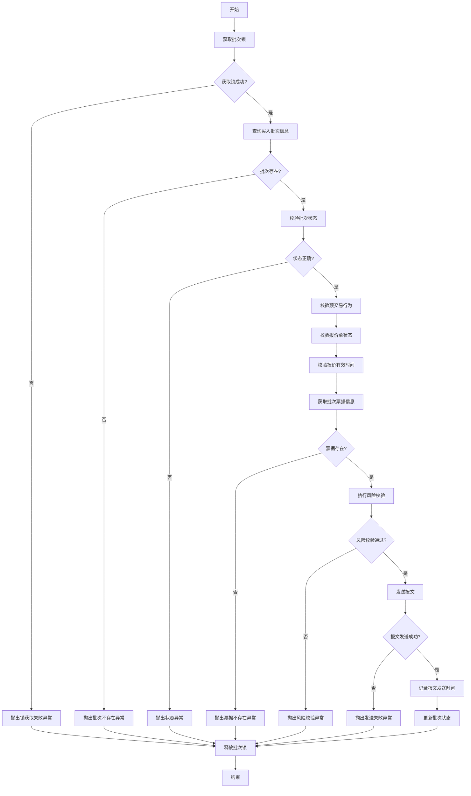
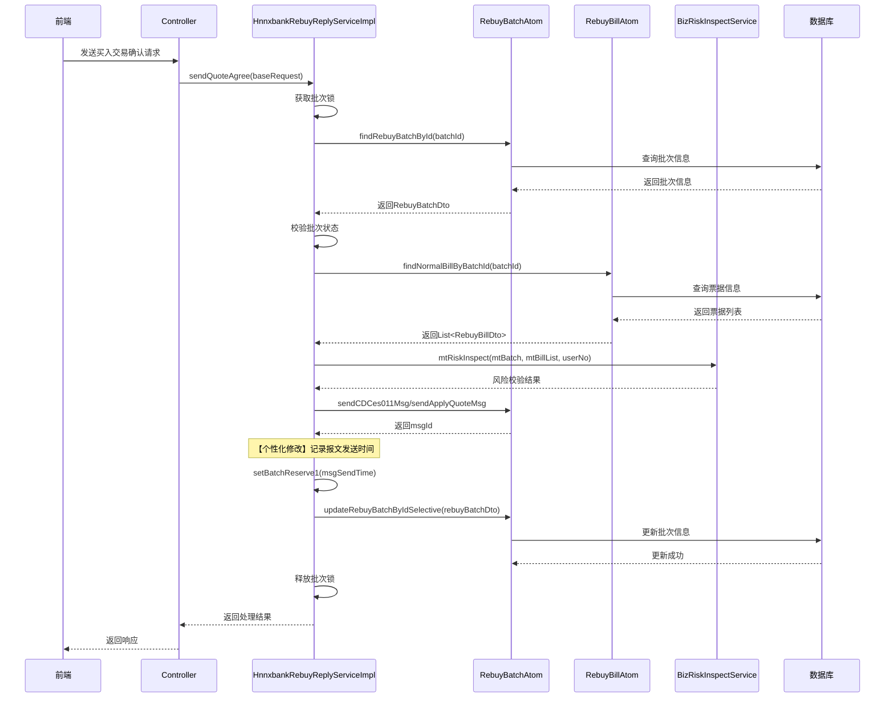

# 买入交易确认报文发送时间记录功能详细设计文档

---

## 文档信息

| 项目 | 内容 |
|------|------|
| 公司名称 | 恒生电子股份有限公司 |
| 产品名称 | HUNDSUN 票据交易管理平台软件 |
| 版本号 | V5.0 |
| 文档类型 | 设计说明书 |
| 部门 | 票据业务事业部 |
| 编写日期 | 2026-04-18 |

---

## 修订历史

| 版本 | 修订人 | 修订说明 | 批准人 | 发布日期 |
|------|--------|----------|--------|----------|
| V1.0 | hnnxbank | 新增：买入交易确认报文发送时间记录功能 | - | 2026-04-18 |

---

## 第一章 系统概述

### 1.1 业务背景

在【场内交易子系统】-【市场交易】-【对话报价】-【买入】-【买入交易确认】菜单中，用户进行买入交易确认操作时，系统会向票交所发送交易确认报文。为满足业务追溯和审计需求，需要在报文发送成功后记录"报文发送时间"，便于后续查询和问题排查。

### 1.2 设计目标

| 目标类型 | 目标描述 |
|----------|----------|
| 功能目标 | 在买入交易确认报文发送成功后，自动记录报文发送时间 |
| 数据目标 | 将报文发送时间持久化存储到数据库批次表的预留字段中 |
| 质量目标 | 确保时间记录的准确性和完整性，不影响原有业务流程 |

### 1.3 范围说明

| 范围类型 | 说明 |
|----------|------|
| 纳入范围 | 买入交易确认报文发送时间记录功能的实现 |
| 排除范围 | 其他交易类型（卖出、转贴现等）的报文发送时间记录 |

---

## 第二章 功能模块划分

### 2.1 模块划分

| 子模块 | 功能 | 说明 |
|--------|------|------|
| 报文发送时间记录模块 | 记录买入交易确认报文发送时间 | 在报文发送成功后，记录当前系统时间 |

### 2.2 模块职责

本功能属于河南农信个性化需求，通过创建个性化服务实现类 `HnnxbankRebuyReplyServiceImpl`，继承产品化基类 `RebuyReplyServiceImpl`，复写 `sendQuoteAgree` 方法，在报文发送成功后增加时间记录逻辑。

**模块调用关系**：

```
Controller 层
    │
    ▼
HnnxbankRebuyReplyServiceImpl (个性化服务实现)
    │
    ├── 继承 ──▶ RebuyReplyServiceImpl (产品化基类)
    │
    ├── 调用 ──▶ RebuyBatchAtom (批次原子操作)
    │
    └── 调用 ──▶ RebuyBillAtom (票据原子操作)
```

### 2.3 接口边界

| 接口名称 | 接口类型 | 说明 |
|----------|----------|------|
| sendQuoteAgree | 内部接口 | 买入交易确认报文发送接口，复写产品化方法 |

---

## 第三章 核心业务流程

### 3.1 业务流程图



### 3.2 时序图

#### 3.2.1 买入交易确认报文发送时序图



### 3.3 关键节点说明

| 节点编号 | 节点名称 | 说明 |
|----------|----------|------|
| N1 | 获取批次锁 | 使用分布式锁机制，防止并发操作导致数据不一致 |
| N2 | 查询批次信息 | 根据批次ID查询买入批次详细信息 |
| N3 | 校验批次状态 | 校验批次状态是否为可发送状态（QBS020/QBS021/QBS022/QBS023） |
| N4 | 校验预交易行为 | 校验报价方式（申请/成交）与预交易行为是否匹配 |
| N5 | 校验报价单状态 | 校验报价单状态是否为"已接收"（QS03） |
| N6 | 校验报价有效时间 | 校验报价有效截止时间和最晚结算时间是否有效 |
| N7 | 获取票据信息 | 获取批次中预关联关系为正常或新增的票据信息 |
| N8 | 风险校验 | 执行市场交易风险校验，只做刚性校验 |
| N9 | 发送报文 | 根据预交易行为和业务类型发送对应报文 |
| N10 | 记录发送时间 | 【个性化】记录报文发送时间到batchReserve1字段 |
| N11 | 更新批次状态 | 更新批次状态和成交状态 |
| N12 | 释放批次锁 | 释放分布式锁，允许其他操作 |

---

## 第四章 数据模型设计

### 4.1 ER 图

本功能不涉及新增实体，使用现有批次表的预留字段存储报文发送时间。

```
┌─────────────────────────────────────┐
│           RebuyBatchDto             │
│         (买入批次数据传输对象)        │
├─────────────────────────────────────┤
│ id : Long                           │ 主键ID
│ batchNo : String                    │ 批次编号
│ msgId : String                      │ 报文标识号
│ dealStatus : String                 │ 成交状态
│ batchStatus : String                │ 批次状态
│ ...                                 │ 其他字段
│ batchReserve1 : String              │ 批次预留字段1 ★
│ batchReserve2 : String              │ 批次预留字段2
│ batchReserve3 : String              │ 批次预留字段3
└─────────────────────────────────────┘
```

### 4.2 数据字典

#### 4.2.1 新增/修改字段说明

| 字段名称 | 字段代码 | 类型 | 长度 | 必填 | 说明 |
|----------|----------|------|------|------|------|
| 批次预留字段1 | batchReserve1 | VARCHAR | 255 | 否 | 存储报文发送时间，格式：yyyy-MM-dd HH:mm:ss |

#### 4.2.2 相关字段说明

| 字段名称 | 字段代码 | 类型 | 长度 | 必填 | 说明 |
|----------|----------|------|------|------|------|
| 主键ID | id | BIGINT | 20 | 是 | 批次主键 |
| 报文标识号 | msgId | VARCHAR | 35 | 否 | 报文发送后返回的消息ID |
| 成交状态 | dealStatus | VARCHAR | 4 | 是 | QS03-已接收、QS04-报价中、QS05-成交中 |
| 批次状态 | batchStatus | VARCHAR | 10 | 是 | QBS020/QBS021/QBS022/QBS023等 |
| 预交易行为 | preTradeBhvr | VARCHAR | 4 | 否 | ANSWER-应答、MODIFY-修改 |

### 4.3 存储策略

| 策略类型 | 说明 |
|----------|------|
| 存储位置 | 复用现有批次表（rebuy_batch）的预留字段 batchReserve1 |
| 数据格式 | 字符串格式：yyyy-MM-dd HH:mm:ss |
| 更新时机 | 报文发送成功后，随批次状态更新一起持久化 |
| 索引策略 | 无需新增索引，该字段仅用于查询展示 |

---

## 第五章 接口定义

### 5.1 API 接口清单

| 接口名称 | 请求方式 | 接口路径 | 说明 |
|----------|----------|----------|------|
| 买入交易确认 | POST | /be/market/rebuy/reply/sendQuoteAgree | 发送买入交易确认报文 |

### 5.2 接口详情

#### 5.2.1 买入交易确认接口

**接口路径**：`/be/market/rebuy/reply/sendQuoteAgree`

**请求方式**：POST

**请求参数**：

| 参数名称 | 参数代码 | 类型 | 必填 | 说明 |
|----------|----------|------|------|------|
| 批次ID | id | Long | 是 | 买入批次主键ID |
| 报价方式 | quoteMethod | String | 否 | APPLY-申请报价、DEAL-成交确认 |
| 法人编号 | legalNo | String | 是 | 法人编号 |
| 用户编号 | userNo | String | 是 | 操作用户编号 |

**请求示例**：

```json
{
  "requestDto": {
    "id": 1234567890,
    "quoteMethod": "DEAL",
    "legalNo": "HNNXBANK",
    "userNo": "TELLER001"
  },
  "reqLegalNo": "HNNXBANK",
  "reqUserNo": "TELLER001"
}
```

**响应参数**：

| 参数名称 | 参数代码 | 类型 | 说明 |
|----------|----------|------|------|
| 返回码 | retCode | String | 返回码，00000表示成功 |
| 返回信息 | retMsg | String | 返回信息 |

**响应示例**：

```json
{
  "retCode": "00000",
  "retMsg": "操作成功"
}
```

---

## 第六章 异常处理机制

### 6.1 错误码定义

| 错误码 | 错误信息 | 处理方式 |
|--------|----------|----------|
| 0BE320500209 | 批次[{}]正在处理中，请稍后重试 | 返回错误提示，提示用户稍后重试 |
| 0BE320500198 | 批次信息不存在 | 返回错误提示，检查批次ID是否正确 |
| 0BE320500033 | 批次状态不正确，不允许操作 | 返回错误提示，检查批次状态 |
| 0BE320500169 | 预交易行为为应答，不允许申请报价 | 返回错误提示，检查操作类型 |
| 0BE320500170 | 预交易行为非应答，不允许成交确认 | 返回错误提示，检查操作类型 |
| ERROR_BATCH_DEAL_STATUS | 报价单状态不正确，当前状态[{}]，应为[{}] | 返回错误提示，检查报价单状态 |
| 0BE320500035 | 批次下无有效票据信息 | 返回错误提示，检查票据关联 |
| NULL_BATCH_ID | 批次ID不能为空 | 返回错误提示，检查请求参数 |

### 6.2 处理流程

```
┌─────────────────────────────────────┐
│           异常处理流程               │
├─────────────────────────────────────┤
│  1. 捕获异常                         │
│     └─> try-catch 包裹业务逻辑       │
│                                      │
│  2. 识别异常类型                     │
│     ├─> BempRuntimeException        │
│     │   └─> 业务异常，直接抛出       │
│     └─> 其他异常                     │
│         └─> 封装为业务异常抛出       │
│                                      │
│  3. 释放资源                         │
│     └─> finally 块释放分布式锁       │
│                                      │
│  4. 返回错误响应                     │
│     └─> 统一错误码和错误信息         │
└─────────────────────────────────────┘
```

### 6.3 恢复策略

| 异常类型 | 恢复策略 |
|----------|----------|
| 锁获取失败 | 等待一段时间后重试，或提示用户稍后操作 |
| 批次不存在 | 提示用户检查数据，无法自动恢复 |
| 状态校验失败 | 提示用户当前状态不允许操作 |
| 报文发送失败 | 记录日志，批次状态不变，可重新发送 |

---

## 第七章 安全策略

### 7.1 认证授权

| 安全措施 | 说明 |
|----------|------|
| 用户认证 | 通过统一认证平台进行用户身份认证 |
| 权限控制 | 基于角色权限控制，只有具备买入交易权限的用户才能操作 |
| 操作日志 | 记录用户操作日志，包含操作时间、操作人、操作内容 |

### 7.2 数据加密

| 加密类型 | 说明 |
|----------|------|
| 传输加密 | 使用 HTTPS 协议进行数据传输加密 |
| 存储加密 | 敏感数据在数据库中进行加密存储 |

### 7.3 访问控制

| 控制类型 | 说明 |
|----------|------|
| 操作限制 | 只有特定角色的用户才能执行买入交易确认操作 |
| 数据隔离 | 基于法人编号进行数据隔离，不同法人只能操作自己的数据 |
| 并发控制 | 使用分布式锁防止并发操作 |

---

## 第八章 技术实现细节

### 8.1 核心算法

#### 8.1.1 报文发送时间记录算法

```
输入：批次ID (batchId)
输出：无（更新批次表）

步骤：
1. 在报文发送成功后执行
2. 获取当前系统时间
3. 格式化时间为 yyyy-MM-dd HH:mm:ss 格式
4. 将格式化后的时间设置到 rebuyBatchDto.batchReserve1 字段
5. 随批次更新一起持久化到数据库
```

### 8.2 代码示例

#### 8.2.1 个性化服务实现类

| 类名 | 方法名 | 说明 |
|------|--------|------|
| HnnxbankRebuyReplyServiceImpl | sendQuoteAgree | 复写买入交易确认方法，增加发送时间记录 |

#### 8.2.2 核心代码片段

```java
/**
 * 买入交易确认服务个性化实现
 * 在报文发送成功后增加记录"报文发送时间"
 *
 * @author hnnxbank
 * @date 2026/04/18
 */
@CustomizedBean
@CloudComponent
public class HnnxbankRebuyReplyServiceImpl extends RebuyReplyServiceImpl implements RebuyReplyService {
    
    private static final Logger logger = LoggerFactory.getLogger(HnnxbankRebuyReplyServiceImpl.class);
    
    @Override
    public void sendQuoteAgree(BaseRequest<OptRebuyBatchDto> baseRequest) {
        // ... 省略前置校验逻辑 ...
        
        // 报文发送
        String msgId;
        if (MtConst.PRE_TRRADE_BHVR_ANSWER.equals(rebuyBatchDto.getPreTradeBhvr())) {
            msgId = rebuyBatchAtom.sendCDCes011Msg(rebuyBatchDto, CpesDataTypeConstants.REC_CODE_0);
            rebuyBatchDto.setDealStatus(MtConst.REBUY_DEAL_STATUS_DEALING);
        } else {
            msgId = null;
            if (CpesDataTypeConstants.BUSI_TYPE_BT01.equals(rebuyBatchDto.getBusiType())) {
                msgId = rebuyBatchAtom.sendApplyQuoteMsg(rebuyBatchDto, rebuyBillDtos);
            } else if (CpesDataTypeConstants.BUSI_TYPE_BT02.equals(rebuyBatchDto.getBusiType())) {
                msgId = rebuyBatchAtom.sendApplyImpawnQuoteMsg(rebuyBatchDto, rebuyBillDtos);
            } else if (CpesDataTypeConstants.BUSI_TYPE_BT03.equals(rebuyBatchDto.getBusiType())) {
                msgId = rebuyBatchAtom.sendApplyOutRightQuoteMsg(rebuyBatchDto, rebuyBillDtos);
            }
            rebuyBatchDto.setDealStatus(MtConst.REBUY_DEAL_STATUS_QUOTING);
        }
        
        rebuyBatchDto.setMsgId(msgId);
        
        // 【个性化修改】记录报文发送时间
        SimpleDateFormat sdf = new SimpleDateFormat("yyyy-MM-dd HH:mm:ss");
        String msgSendTime = sdf.format(new Date());
        rebuyBatchDto.setBatchReserve1(msgSendTime);
        logger.info("买入交易确认报文发送成功，批次ID：{}，报文ID：{}，发送时间：{}", 
                    batchId, msgId, msgSendTime);
        
        // 更新批次状态
        rebuyBatchDto.setBatchStatus(
            QuoteBatchStatusConstant.sendQuoteBatchStatusMap.get(rebuyBatchDto.getBatchStatus()));
        rebuyBatchAtom.updateRebuyBatchByIdSelective(rebuyBatchDto);
    }
}
```

### 8.3 性能优化

| 优化项 | 说明 |
|--------|------|
| 时间格式化 | 使用 SimpleDateFormat 进行时间格式化，性能满足业务需求 |
| 日志记录 | 使用异步日志记录，不影响主流程性能 |
| 数据库更新 | 复用现有批次更新操作，不增加额外数据库访问 |

---

## 附录

### 附录A 参考资料

| 文档名称 | 说明 |
|----------|------|
| BEMP开发规范 | 项目开发规范文档 |
| RebuyReplyServiceImpl 源码 | 产品化基类源码 |
| RebuyBatchDto 源码 | 批次数据传输对象源码 |

### 附录B 术语表

| 术语 | 说明 |
|------|------|
| 买入交易确认 | 买方对卖方报价进行确认的交易行为 |
| 报文发送时间 | 系统向票交所发送交易确认报文的时间 |
| @CustomizedBean | 个性化Bean注解，用于标注个性化实现类 |
| batchReserve1 | 批次表预留字段1，用于存储扩展信息 |

---

**文档编写**：hnnxbank
**编写日期**：2026-04-18
**版本**：V1.0
